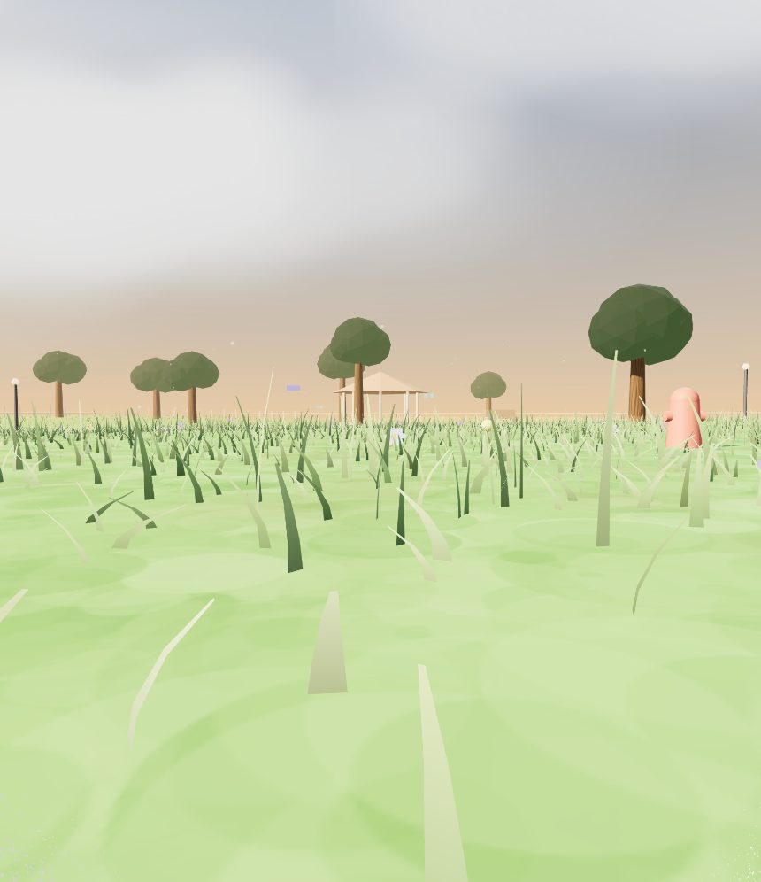

# 🐾 Westie in the Park

A **beautiful, high-performance West Highland Terrier simulator** that runs in any modern browser. You *are* Ludo, a small white fluffy terrier with the zoomies, let loose in a golden-hour park. Run through swaying grass that parts around your paws, chase squirrels up trees, scatter pigeons with a bark, fetch a thrown ball, and sniff out hidden treats — in first-person, or pull the camera back to watch Ludo bound around.

Built as a **single self-contained HTML file** with [Three.js](https://threejs.org/) (r149, vendored locally). No build step, no network at runtime, no external files — every blade of grass, tree, and sound effect is generated procedurally. The dog himself is the real deal: a **rigged, animated 3D model generated from photos of the actual Ludo**, embedded directly into the HTML (base64) and decoded by a built-in mini glTF parser, so the file still runs from `file://` with zero dependencies.



*First-person — you are Ludo. Press `V` to cycle to the chase and face cameras:*


---

## ▶️ Running it

The simplest way — **just open the file**:

```bash
open index.html        # macOS
# or double-click index.html in your file manager
```

Because Three.js is vendored as a classic (non-module) script, `index.html` works directly from `file://` with no server and no internet connection.

If your browser is strict about `file://` for any reason, serve the folder over HTTP:

```bash
python3 -m http.server 8123
# then visit http://localhost:8123/
```

Click **“Let’s go!”**, then click the canvas to capture the mouse and start running.

---

## 🎮 Controls

### Desktop
| Input | Action |
|---|---|
| `W A S D` / Arrows | Run around |
| `Shift` (hold) | Sprint — zoomies! (FOV punch, panting) |
| `Space` | Bark 🐶 (scatters nearby pigeons & squirrels) |
| `E` | Toggle scent mode — follow glowing trails to treats |
| `F` | Throw the ball, then chase & fetch it |
| `V` | Cycle camera — first-person → **face (see Ludo!)** → chase |
| `C` | Toggle dog-vision color grade |
| `R` | Reduce-motion / comfort mode (halves head-bob & FOV punch) |
| `M` | Mute / unmute sound |
| 🐕 button | Load a different Ludo model (`.glb`) — or just drag one onto the park |
| Mouse | Look around (click the park to capture the mouse) |
| `Esc` | Free the cursor (so you can click the on-screen 🎥/🔊/👁️/🌀 buttons); click the park to look again |
| `P` | Pause / show menu |

### Mobile / touch
- **Left thumbstick** — move
- **Drag the right half of the screen** — look
- On-screen buttons — 💨 sprint · 🐶 bark · 👃 sniff · 🎾 fetch

---

## ✨ What’s in the park

- **Golden-hour atmosphere** — warm directional sun, gradient sky with a sun disc + glow, exponential fog that doubles as the draw-distance budget, ACES filmic tone-mapping, drifting clouds.
- **Three cameras** (press `V` to cycle) — **first-person** (eye height ~36 cm, visible muzzle/nose/ears/paws, gait-driven head-bob, lolling tongue when you pant); a **chase cam** that trails behind and above so you can watch the whole fluffy Westie — body, erect carrot tail, prick ears, short legs, bouncing shadow; and a **face cam** that swings out in front so you can see Ludo's face — black button nose, eyes, and prick ears — as he runs toward you.
- **Living grass** — fine, curved blades in mixed-height clumps over a seamless turf texture, with gentle wind, tree shadows, and **parting around the dog**. Up to 96,000 blade placements (32,000 on mobile), with gravel and water excluded.
- **Four no-fail interactions** — chase squirrels up trees, fetch a physics-driven ball, bark to explode a flock of pigeons skyward, and sniff out buried bone-treats via scent mode.
- **Natural scenery** — branching trees with layered leaf silhouettes, muted lawn colors, fine gravel paths with uneven verges, and a shallow pond edged with stones, cattails, reeds, and lily pads. All scenery is generated locally; no asset downloads.
- **Detailed wildlife and furniture** — pigeons with folding feathered wings, feet, head movements, and banking flight; squirrels with bounding paws and curved tails; slatted benches, framed lanterns, a fitted hydrant, and a terrain-following fence with a closed gate.
- **Walkable gazebo** — floorboards, steps, railings, rafters, and a shingled roof. Enter from the steps facing the center of the park.
- **Water and small details** — procedural sky reflections, translucent shallows, spreading paw ripples, flower stems and leaves, patterned butterfly wings, a felt tennis ball with a curved seam, and worn ground around furniture.
- **A populated park** — a bandstand gazebo, a pond with rippling water and splashes, park benches, wrought-iron lamp posts, a picket-fence boundary, a fire hydrant (of course), flower clusters, butterflies, and drifting pollen.
- **Synthesized audio** — bark, footsteps, panting, splashes, bird chirps, ambient wind, and collection chimes are all generated live with the Web Audio API (no sound files).
- **Light, joyful scoring** — tallies for treats found 🦴, squirrels treed 🐿️, and balls fetched 🎾, with warm “Good dog!” toasts. No timer, no lose state.

---

## 🏗️ Architecture

Everything lives in **`index.html`** as one IIFE. There is no framework and no bundler.

```
westie-park-sim/
├── index.html          # the entire simulator (HTML + CSS + JS + embedded Ludo model)
├── three.min.js        # Three.js r149 UMD build (global `THREE`), loaded as a peer file
├── assets-src/         # model source files & dev viewers (never loaded at runtime)
├── tools/
│   └── add-ludo.mjs    # one-command pipeline: new Meshy .glb → embedded default model
├── README.md
└── AGENTS.md           # AI-agent context / conventions / status
```

### Updating the dog model

Downloaded a new export from Meshy? One command (no installs, <1 s):

```bash
node tools/add-ludo.mjs ~/Downloads/ludo-v4.glb
```

It validates the rig/clip/texture, shrinks the texture, writes an optimized copy to
`assets-src/`, and embeds it as the game's default (previous `index.html` backed up
automatically). Or try a model without embedding it: the in-game **🐕 button** /
drag-and-drop loads any `.glb` for the current session only.

High-level structure inside `index.html`:

1. **HUD & overlays** — pure HTML/CSS (stats, zoomies meter, toasts, control hints, start/pause screen, mobile touch controls, scent-mode & fur-fringe vignettes).
2. **Renderer / scene / camera** — `WebGLRenderer` with PCFSoft shadows, ACES tone-mapping, DPR cap.
3. **Procedural textures** — ground, bark, and fur are drawn to `<canvas>` and uploaded as tileable `CanvasTexture`s.
4. **World** — sky-dome shader, lighting (one shadow-casting sun + hemisphere fill), plane terrain with gentle hills, instanced grass with a custom wind/parting shader, instanced trees / flowers / fence, pond, and assorted props.
5. **The dog rig** — a `playerRig` (yaw) → grounded body (shadow + look-down) and a `pitchObj` → camera → first-person head parts (muzzle, nose, ears, paws, tongue).
6. **Systems** — squirrels, pigeons, ball physics, treats + scent trails, butterflies, pollen, splash particles.
7. **Audio** — a small Web Audio synth module.
8. **Input** — keyboard + pointer-lock mouse, and a full touch control layer.
9. **Main loop** — fixed-ish delta-clamped `update()` + render, with the camera shadow frustum following the dog.

### Performance notes
- One directional shadow light only; its ortho frustum follows the dog. Grass does not self-shadow (it uses baked root darkening).
- Instanced meshes for every repeated prop (grass, trees, foliage, flowers, fence).
- Fog (`FogExp2`) is tuned so the park dissolves into gold well before the far plane — it doubles as a free cull radius.
- Wind and grass-parting run entirely in the vertex shader (zero per-frame CPU cost on blades).
- `devicePixelRatio` is capped (2 desktop / 1.5 mobile); grass count, shadow-map size, and particle counts scale down on mobile.
- The render loop pauses when the tab is hidden.

---

## 🌐 Browser support

Any browser with WebGL2 and the Web Audio API: recent Chrome, Edge, Firefox, and Safari (desktop and mobile). Audio starts on the first click/tap to satisfy autoplay policies.

---

## 📜 License

Three.js is © its authors under the MIT License (see header in `three.min.js`). The simulator code in `index.html` is free to use and modify.
